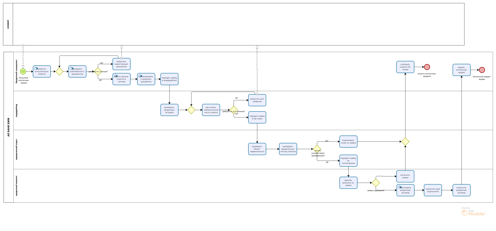
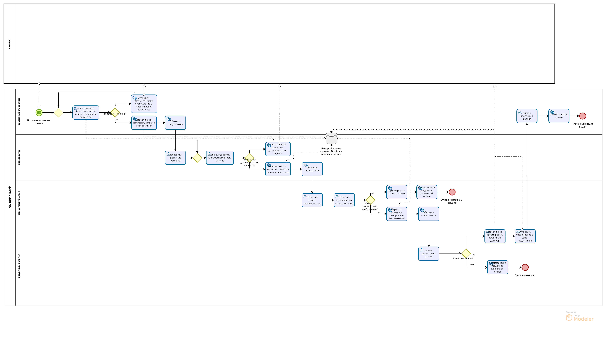

# Наиля Зербалиева — System Analyst Portfolio

Студентка РТУ МИРЭА, направление «Бизнес-информатика».

Развиваюсь в системном анализе и проектировании информационных систем.

### Навыки

- BPMN 2.0
- UML
- C4
- REST API
- Swagger / OpenAPI
- SQL
- PostgreSQL
- Kafka
- Микросервисная архитектура
- User Story Map

### Курсы
.pdf)

---

## Анализ и оптимизация процесса обработки ипотечных заявок

### Задача

Проанализировать текущий процесс обработки ипотечных заявок,
выявить проблемные места и разработать целевой процесс TO-BE.

### Что сделано

- построена BPMN-модель AS-IS;
- выявлены проблемные места процесса;
- сформирована User Story Map;
- спроектирована BPMN-модель TO-BE;
- предложена автоматизация отдельных этапов;
- оценён эффект от изменений.

### Диаграммы

**AS-IS**

**TO-BE**

---

## Асинхронная система модерации музыкального контента

### Задача

Спроектировать микросервисную систему для асинхронной
модерации музыкального контента.

### Что сделано

- спроектирована архитектура из двух микросервисов;
- описано взаимодействие сервисов через Kafka;
- спроектирована модель данных PostgreSQL;
- использованы JSONB-поля;
- описан REST API;
- построена UML Sequence Diagram.

### Диаграмма взаимодействия

### Документация API

[OpenAPI specification](03-music/openapi.yaml)

